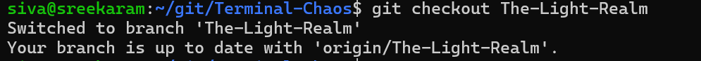

\*\*Terminal Chaos\*\*

1\. - Clone a repository using \`git clone\` to begin

git clone <https://github.com/amansxcalibur/Terminal-Chaos>

mkdir Handbook

{width="5.423611111111111in" height="0.25in"}

2\. Entering Arrakis-dex:

\- Navigate to the git directory using the command \`cd
Terminal-Chaos/Arrakis-dex\`.

\- Use the command \`ls\` to look around.

{width="5.25in" height="0.7569444444444444in"}

A dangerous sandstorm is coming, so use \`cd \<directory\>\` to find
shelter.

cd \"Eolian Caves\"

\- In the Eolian Caves, explore using the \`ls\` command. Use the
\`tree\` or \`find\` command to locate important objects, like a
parchment.

find \| grep parchment

{width="5.763888888888889in"
height="0.3263888888888889in"}

./Entrance3/01/01L/01/02/01/02/01/parchment.txt

Retrieve its code using \`cat\` and save it in your Handbook.

cat \"./Entrance3/01/01L/01/02/01/02/01/parchment.txt\"

{width="5.763888888888889in"
height="3.0833333333333335in"}

cat \"./Entrance3/01/01L/01/02/01/02/01/parchment.txt\" \> \~/

Handbook/code.txt

\- If you can't read the parchment, you may need to activate a
medallion.

3\. \*\*Exploring Different Realms:\*\*

{width="5.465277777777778in"
height="0.7777777777777778in"}

\- Switch between realms using \`git checkout \<branch name\>\`.

{width="5.763888888888889in"
height="0.5069444444444444in"}

\- In the Light Realm, search for collectibles, but beware of dangers
like hostile creatures and bosses.

{width="5.763888888888889in"
height="0.4166666666666667in"}

\*\*Boss Battle:\*\*

\- To defeat Kharnok the Bloodforged, you'll need to parry his attacks
and use magic to weaken him.

sudo find . -print \| grep -i \'Kharnok\*\'

{width="5.763888888888889in"
height="0.6597222222222222in"}

ü/git/Terminal-Chaos/Arrakis-dex/Eolian
Caves/Entrance3/01/01L/01/02/01/02/01/Citadel/.linuxDist/dist/Kharnok
the BloodForged

\*\*Crafting a Holy Spell:\*\*

\- Use \`grep\` to find filenames of herbs that contain the words
\"holy\" and \"good.\"

ls -R \| grep -i -e holy -e good

{width="5.763888888888889in" height="1.9375in"}

{width="5.763888888888889in"
height="1.4930555555555556in"}

Moonbloom

Foxglove

Dragon\'sBreath

Jimson Weed

Henbane

Hemlock

Dreambloom

Lavender

./Arrakis-dex/Eolian Caves/Entrance3/01/01L/01/02/Steep
slope/Cliff/Cliff-Edge/Moonbloom/Holy.txt

./Arrakis-dex/Eolian
Caves/Entrance3/01/01L/01/02/01/02/Foxglove/Good.txt

./Arrakis-dex/Eolian
Caves/Entrance3/01/01L/01/02/01/02/vegetation/Dragon\'sBreath/Holy.txt

./Arrakis-dex/Eolian
Caves/Entrance3/01/01L/01/02/01/02/vegetation/Dragon\'sBreath/Holy_info.txt

./Arrakis-dex/Eolian Caves/Entrance3/01/01L/01/02/01/02/glowing
herbs/Jimson Weed/Good.txt

./Arrakis-dex/Eolian Caves/Entrance3/01/01L/01/02/01/02/glowing
herbs/Henbane/Good.txt

./Arrakis-dex/Eolian Caves/Entrance3/01/01L/01/02/01/02/glowing
herbs/Hemlock/Good.txt

./Arrakis-dex/Eolian Caves/Entrance3/01/01L/01/02/01/02/glowing
herbs/Dreambloom/Holy.txt

./Arrakis-dex/Eolian Caves/Entrance3/01/01L/01/02/01/02/glowing
herbs/Dreambloom/Holy_info.txt

./Arrakis-dex/Eolian Caves/Entrance3/01/01L/01/02/01/02/glowing
herbs/Lavender/Good_info.txt

./Arrakis-dex/Eolian Caves/Entrance3/01/01L/01/02/01/02/glowing
herbs/Lavender/Good.txt

Then replace each letter in the encoded phrase with the letter that
comes before it. Concatenate the herbs with the first one being the word
containing 'oo' in it. Remove all vowels from the final code and voila,
you have made yourself a holy spell.

string = \'lavender\'

new_string = \'\'.join(chr(ord(char)-1) for char in string)

print(new_string)

lnnmaknnlenwfknudcqzfnmraqdzsgihlrnmvddcgdmazmdgdlknbjcqdzlaknnlkzudmcdq

lnnmknnlnwfkndcqzfnmrqdzsghlrnmvddcgdmzmdgdlknbjcqdzlknnlkzdmcdq

Holy Spell: DdlyNghtshdClntrChmmlBlldnnBsl

4\. \*\*Unlocking the Dark Realm:\*\*

\- Use the Celestial Veil Amulet to unlock special chests in the Dark
Realm.

\- The Dark Realm is split into two parts, and only the amulet can guide
you through.
