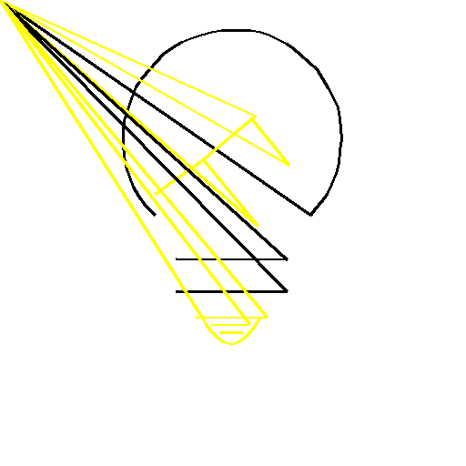

The Challenge:

\# Operation Pixel Merge

You assume the role of Fleet Admiral Reinhard von Lohengramm, leading
the Galactic Empire's forces in a crucial war. You have recently
received a transmission from one of your captains, most likely
containing some very important information regarding the ongoing war but
alas it seems to be split into a hundred different images!

Create a script using OpenCV and Pillow, utilizing some clever image
recognition and manipulation techniques to stitch together these
fragmented parts to reveal the secret message!

\## Overview

The assets folder in this repository has a bunch of images, each of
dimensions 512x512 pixels. Each one is composed of a white background
with a \*\*singular\*\* coloured dot on it. The images are named with a
number indicating their order in the sequence.

There are also few images which are completely white, the importance of
these will be discussed further down.

\## Instructions

\* Sort the images by the number specified in the filename

\* Use OpenCV to detect the dot on each image and record its coordinates
as well as its colour

\* Use Pillow to draw a line between the dot on one image and the dot on
the succeeding image

\* The colour of the line should be governed by the colour of the
starting dot

\* The pure white images represent a line break. I.e. you should not
draw to it from a previous image

\## Resources

\* \[OpenCV\](https://docs.opencv.org/4.x/)

\*
\[Pillow\](<https://pillow.readthedocs.io/en/stable/reference/ImageDraw.html>)

The Solution:

1.  the images were sorted by the number specified in the filename

2.  a python program dot_coord_colors.py was written to identify the
    coordinates of the dots and the colour of the dots. The program
    scans the images in the assets directory and detects yellow and
    black colour dots and their x, y coordinates. The program will write
    to an output file, say, dot_coordinates_and_colors.txt, the x, y
    coordinates if a dot is present, else 'no dot' is written and the
    colour of the dot as black/yellow.

3.  A python program join_pts.py was written to read the coordinates and
    colour data from the file dot_coordinates_and_colors.txt and the
    coordinates are written to the file coord.txt. A new image with
    white background of 512 x 512 pixels size is created. Lines joining
    the coordinates collected from the asset images are drawn with line
    colour selected as the colour of the starting dot. When a blank
    image, i.e. an image without dot is encountered in the assets
    folder, the line is discontinued and started at the next coordinate.
    Thus, all the dots are joined together on the new white image to
    form the final image as shown below.

> 
